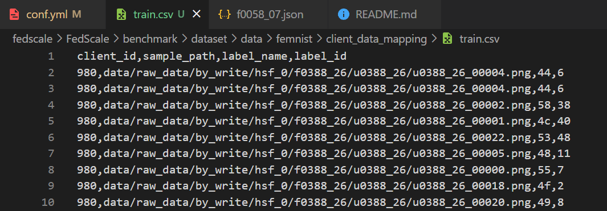
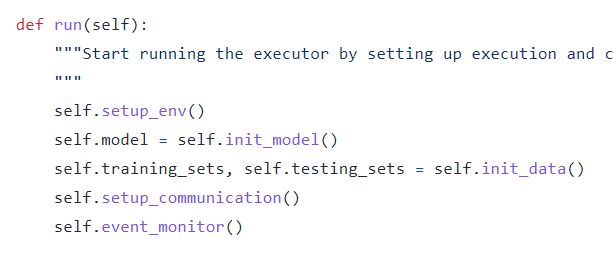
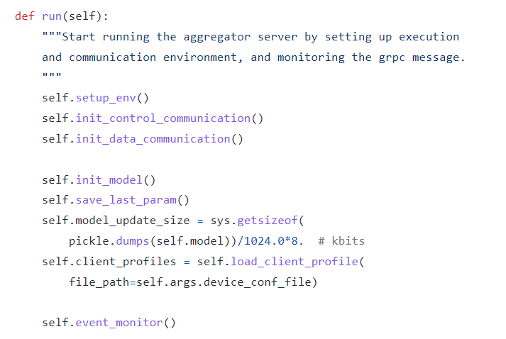
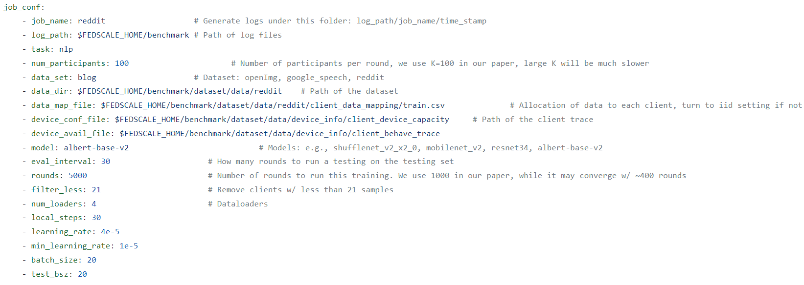
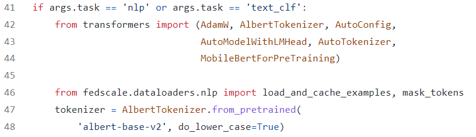
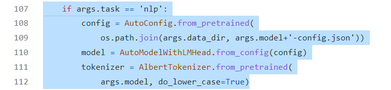

## -1...
    以下所有内容均出自于对FedScale的源码阅读。
    考虑到FedScale刚刚推出的[website](https://fedscale.github.io/)中有 API documentation，所以本markdown中与API documentation冲突的地方还是以API documentation为准。

## 0. About this framework (some details)
* (这一部分不是必读的)

1. 关于每次训练的（超）参数（的模板），参考 `benchmark/configs/femnist/conf.yml` 中的内容
    * 如果不知道可以加的参数的全集是什么，可以在 `/fedscale/core/config_parser.py` 中查看 
    * 有一些参数config是在代码运行过程中自动加入的（比如 `--this_rank` 这个参数，用来标记 executor 的 index，从1开始编号，就是在 docker/driver.py 中自动生成的），一般这种config不需要我们自己去管它
    * `所有参数的默认值也在这里面`

2. 关于整个训练的启动过程，可以参考 `docker/driver.py` 中的内容
3. `/fedscale/core/fllibs.py` 这个python file 主要是用来提供对全局适用的 `model selector` 和 `dataset selector`

4. 关于FedScale对femnist的处理：（__Why is this essential?__ 因为我们要跑自己数据的话需要很熟悉这个流程）
    * __在`benchmark/dataset/data/femnist/`这个目录下，有`data/`和`client_data_mapping/`这两个子目录。其中 `data/` 是存每个client的手写字符的.png文件的；`client_data_mapping/` 大概存了如下图这么多信息（用来划分不同用户的数据集）__
    * 
    * 如果一个dataset没有`client_data_mapping/`这个目录，那么划分`client`数据的时候就会`uniform`划分（参考`/fedscale/dataloaders/divide_data.py`中的`uniform_partition`）
    * 否则，就会调用 `trace_partition` 根据 `client_data_mapping/` 中的信息进行划分（变量 `unique_clientIds` 表示原id到新id的mapping, `clientId_maps` 表示sample_id到新id的mapping）。函数返回后 `self.partitions` 就是记录了每一个新id对应了哪些sample_id(list套list)
    * 但这还远远不够，下面是FedScale调用femnist数据集的详细流程：
        1. 初始数据集的对象都对应于 `fedscale/dataloaders/femnist.py` 中的类 `FEMNIST()`, 同时我们需要用到 `fedscale/dataloaders/utils_data.py` 中的 `get_data_transform('mnist')` 来将我们的 .png 图片转化成 torch.tensor(不确定，但应该差不多)；类 `FEMNIST()` 定义了内置函数 `__getitem__()`，可以直接拿出一个index对应的图片和它的label（在后面可以用到）
        2. 然后我们拿到最开始的数据集是通过 `/fedscale/core/fllibs.py` 中的 `init_dataset()` 这个函数，拿到如上述样子的对象（__attention: 之后我们如果要跑我们自己的除了feminst和reddit的数据集的话，就需要在这个`init_dataset()`里多加一个elif，并且在`fedscale/dataloaders/($our_dataset_name).py`里写好基本功能，可能也需要在`fedscale/dataloaders/utils_data.py`里多写一个新数据集的`transform()`函数的内容__）
        3. 而真正要用到数据集的时候是在 `/fedscale/core/execution/executor.py` 中的 `Executor.init_data()`。这个函数会先调用上面说到的 `init_dataset()`，然后再把我们得到的初始数据集喂进 `/fedscale/dataloaders/divide_data.py`中的类`DataPartitioner`进行上面描述过的client数据划分，对femnist而言就是对着`client_data_mapping/`目录下的文件进行划分
        4. (这一条针对的是 `/fedscale/core/execution/executor.py` 中的内容)但这仅仅完成了数据集的初始化，等到之后每一个client要`train`或者`test`并需要用数据集时，会分别在`training_handler()`和`testing_handler()`里调用 `/fedscale/dataloaders/divide_data.py`中的函数 `select_dataset()` 进行数据选取。而这个函数则会根据你是哪个`executor`(--this_rank)来从对应的数据集中选出数据返回
    * 最后说明一下，fedscale对femnist的62个label的标注应该是乱序的(并不是10个数字26*2个字母是顺序排列成label的)，并且暂时也还未找到这个mapping

5. (大部分)通信好像用的(都)是`gRPC`

6. `/fedscale/core/execution/executor.py` 中的 `update_model_handler()` 和 `load_global_model()` 是 `executor`用来和`aggregator`交互model parameter的地方。其中 `self.temp_model_path` 这个变量就记录了你这个 `executor` 对应的临时模型的路径

7. 关于FedScale对Test过程的处理：（__Why is this essential?__ 因为跑FATE dataset中的classification需要测试的metric不是acc而是auc，这就需要我们很了解FedScale中Test的流程）
    * 首先值得注意的是，不管是 `executor` 还是 `aggregator`，它们运行的Logic都是类似的（如图，第一个是executor，第二个是aggregator   外界都是通过调用 `run()` 这个函数来跑）。均为 1. 初始化 2. 建立通信(gRPC) 3. event_monitor() 针对事件进行反应（同时可以注意到 agregator的run()中还有`模型大小`的信息，这一点或许可以直接用到之后的`logging_system`中）
    * 然后是两个非常重要的函数： `/fedscale/core/aggregation/aggregator.py` 里的 `CLIENT_EXECUTE_COMPLETION()` 和 `CLIENT_PING()`. 这两个函数的作用相当于大部分训练时间中 executor 和 aggregator 唯一的通信桥梁，起到了`承上启下`的作用。（顺带一提 `/fedscale/core/channels` 中的内容应该主要就是这些通信函数的 gRPC 协议之类的东西）
    * (个人推测的背景信息) `executor` 和 `aggregator` 都用了双端队列来协助 `event_monitor()` 处理事件。`executor`中的叫`self.event_queue`；`aggregator`中的叫`self.broadcast_events_queue`
    1. 当 `executor` 的 `event_monitor()` 收到了要Test的信号，就会调用 `self.Test()` 进行测试（同时附上一些meta-data，目前只有`client_id`，在`/fedscale/core/aggregation/aggregator.py`的`get_test_config()`中说明了开发者后续可以根据自己的需求添加其他信息，这些meta-data都会被传到`executor`的`self.Test()`中）
    2. 然后 `self.Test()`就会call `self.testing_handler()`，而它又会先调用 `select_dataset()` 这个函数来获得自己这个 `executor` 对应的测试数据（这个函数在之前说明femnist导入的过程中提到过，不过每次select_dataset()都会re-shuffle新id对应的sample_id这个List，新id的定义同样见上面的3.），然后再调用 `/fedscale/utils/model_test_module.py` 里的 `test_model()` 进行对模型的测试。__不出意外的话这（`/fedscale/utils/model_test_module.py`的函数）应该是整个Test过程最底层的part了，到时候如果要把acc改成auc的话主要改这里就好了（当然其他也要稍微改点，比如logging输出的信息。logging的信息除了在`self.testing_handler()`里剩下应该都在`aggregator`的部分里，一会儿提）__ 。 
        * __还有一点很重要，那就是 `test_model()` 返回的 `testRes = {'top_1': correct, 'top_5': top_5,'test_loss': sum_loss, 'test_len': test_len}` 会作为通信中的 `data_result`完整地返回给 `aggregator`，详情见后面 `aggregator`的部分。如果我们要改auc的话或许需要动一下这部分__

    3. 然后`self.testing_handler()`返回local test的结果给 `self.Test()` ， 再通过 `self.aggregator_communicator.stub.CLIENT_EXECUTE_COMPLETION()` 回传给 `aggregator` 本`executor`的local test的结果 （当然之后可能还会有一轮通信，好像不是很重要这里就不关注了）
    4. 然后就是 `aggregator` 的部分了。可以注意到 `CLIENT_EXECUTE_COMPLETION()` 里第三行解析的 `request.data_result` 其实就是我们上面说过的`testRes = {'top_1': correct, 'top_5': top_5,'test_loss': sum_loss, 'test_len': test_len}`，我们会把它传给 `self.add_event_handler()` 并在其中加到 `aggregator` 的信息队列（上面提过）中去。
    5. 之后 `Aggregator.event_monitor()` 会发现收到了 `executor` 的 local test result， 然后调用 `self.testing_completion_handler()`
    6. 在这里面，上述被加到信息队列的local test result会被收进 `self.test_result_accumulator` 这个变量里
    7. 而当`self.testing_completion_handler()`发现所有这一轮测试的 `client` 都把local test result发回来了之后，就会调用 `/fedscale/core/logger/aggragation.py` 中的 `aggregate_test_result()`，实现从 `test_result_accumulator` 到 `testing_history` 的 mapping的同时在 aggregator 端进行logging （__也就是上面说的aggregator端对应可以改的地方__）

8. 关于FedScale对reddit的处理：
    * 很多部分和femnist重叠，这里挑一些不一样的地方中的重点说明一下
    * 首先比较迷惑的一点是它对应于`args.data_set=blog` :  。__这也就是说我们需要查看`/fedscale/core/fllibs.py`中`init_dataset()`里`'blog'`对应的内容__
    * 同时在上面reddit的config中也可以发现模型是`albert-base-v2`，于是我们再到`/fedscale/core/fllibs.py`的`init_model()`中查看相关代码，发现了：  所以这个config应该是用了预训练好的一种transformer? 但由于我们之后需要用`LSTM`，所以这一部分的代码应该是需要修改一下的。FedScale应该提供了大部分常见的CV/NLP模型（的pytorch代码），只不过它的demo里只用了很少一部分，剩下一部分写好的model的可用性未知（__比如在`init_model`中nlp的task目前只能使用预训练的transformer，虽然FedScale也提供了RNN等传统的NLP model. 考虑到FedScale还在快速update中，有很大概率之后会完善这一部分（__）
    * 由于服务器一直连不上，也没有把FedScale的reddit下下来好好观察，连上之后再update一下这个条目（

9. __关于FedScale提供的model：__
    * 主要考虑pytorch的model，因为FedScale大多数情况下都是用pytorch. 写好的模型目录在 `/fedscale/utils/models`
    * 其中我们要用的大部分模型（femnist:lenet/logistic_regression ; reddit:rnn(lstm) ; FATE:logistic_regression/linear_regression）在`/fedscale/utils/models/simple/models.py`中都有，不需要我们自己写
    * 但我们可能还需要`mlp`，也就是多层感知机，可以直接搬运[为之前框架写好的](https://github.com/AI-secure/FLBenchmark-evaluations-dirty/blob/main/FedML/fedml/untracked/non_linear/mlp.py)

10.  其他的部分可能没太仔细看，或者看了但感觉对目前的task帮助不大。之后可以补充一下（如果需要的话），而且到时候可以直接看 API documentation 了

## Task 1
* 主要参考上面的 `4. 关于FedScale对femnist的处理` 和 `8. 关于FedScale对reddit的处理`，对源码进行一定程度的修改使得我们可以跑通我们自己的 `femnist`/`reddit`/`give_credit_horizontal`/`default_credit_horizontal` 数据集 （后两个是 FATE的数据集，具体使用方法可以参考[toolkit](https://github.com/AI-secure/FLBenchmark-toolkit/tree/main/tutorials)，数据集的属性可以参考 [sheet](https://docs.google.com/spreadsheets/d/1RBJpqjUeYOq5ffM_8B9NRSfC_zZTQRrjLuld_FVGElI/edit#gid=0)中的内容）
* 可以先使用它默认的metric : accuracy 进行观察

## Task 2
* 主要参考上面的 `7. 关于FedScale对Test过程的处理`，对源码进行一定程度的修改使得可以支持二分类（`give_credit_horizontal`/`default_credit_horizontal`）的 `AUC` (建议使用 sklearn 算AUC的函数，以实现和之前框架的对齐)

## Task 2.5
* 其实可能还需要一个script用来把我们从config.json转化成FedScale的conf.yaml，这个大概在 Task2 和 Task3 之间比较合适（个人观点

## Task 3
- logging system
- 这周不急

## Task 4
- build a docker image for it
- 这周不急